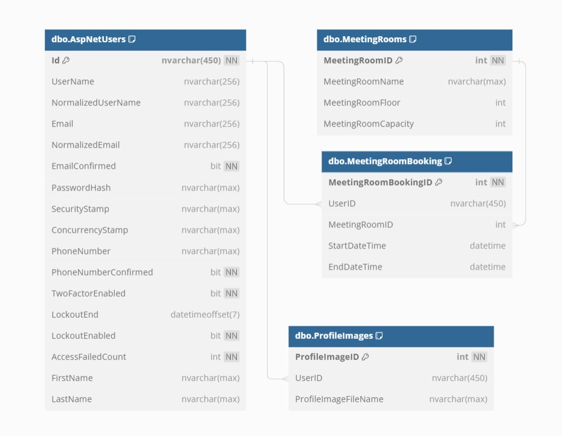
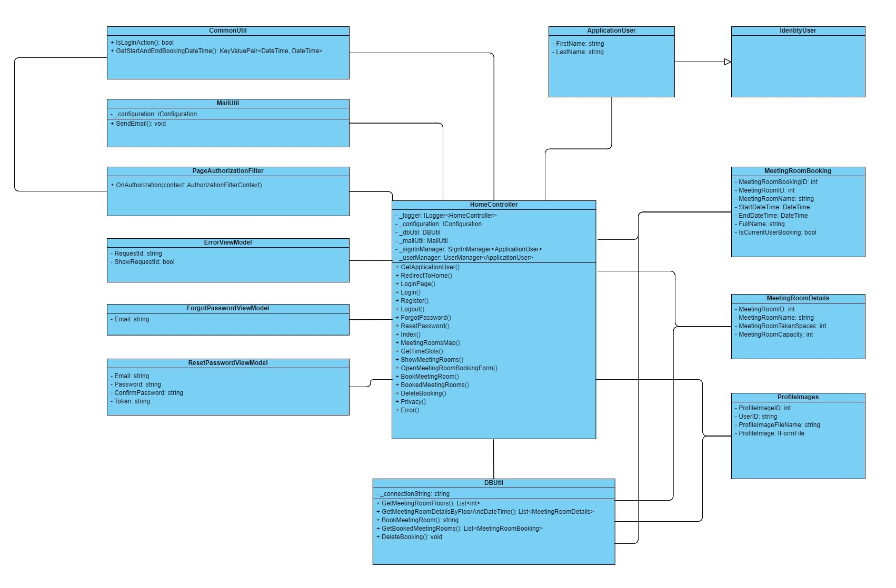
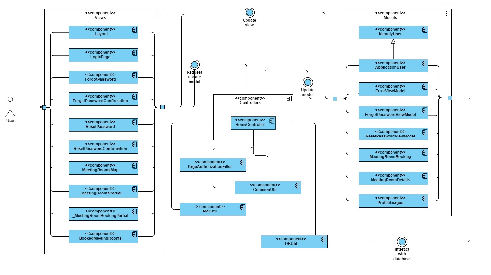

# Office Meeting Rooms Booking System
The purpose of the application is to allow the end users to manage their bookings of the meeting rooms in the office.

## Application Setup Procedure in Visual Studio and SSMS
### One-time steps
1. Run "Update-Database" in Package Manager Console to create OfficeMeetingRoomsBooking database and apply existing migrations, related to ASP.NET Core Identity tables.
### Steps to start the application
1. Pull the latest changes.
2. Run the new sql scripts from the DBScripts folder (if any) in Microsoft SQL Server Management Studio (SSMS).
3. Since the repository is public, some SMTP credentials, such as SmtpUsername / SmtpPassword / FromAddress from the EmailSettings in appsettings.json, are not provided to avoid exposing sensitive data. Fill them in for the forgotten password feature to work, and for other future email related features.
4. Build the solution (Build -> Build Solution).
5. Start the application (Debug -> Start Debugging / Start Without Debugging).

## Diagrams
### Database diagram

### Class diagram

### Component diagram

